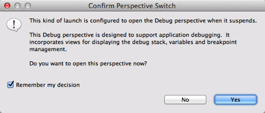
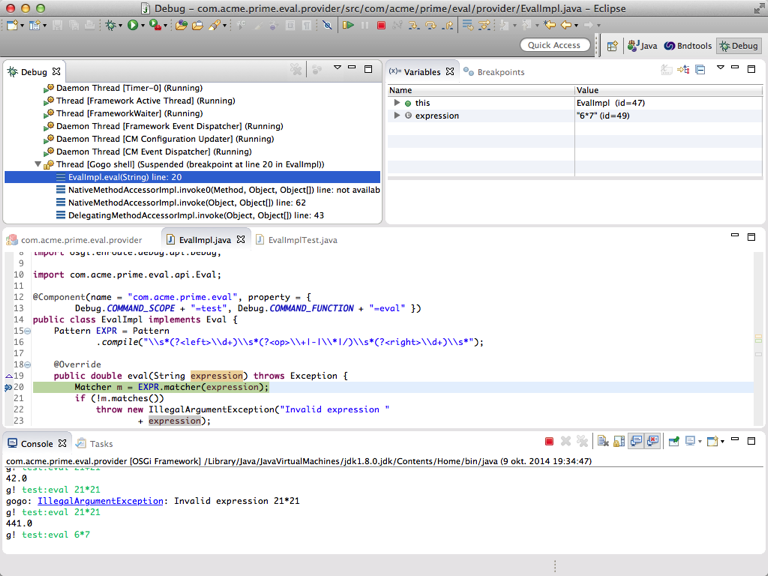
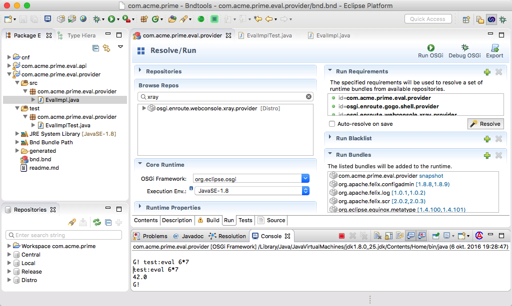
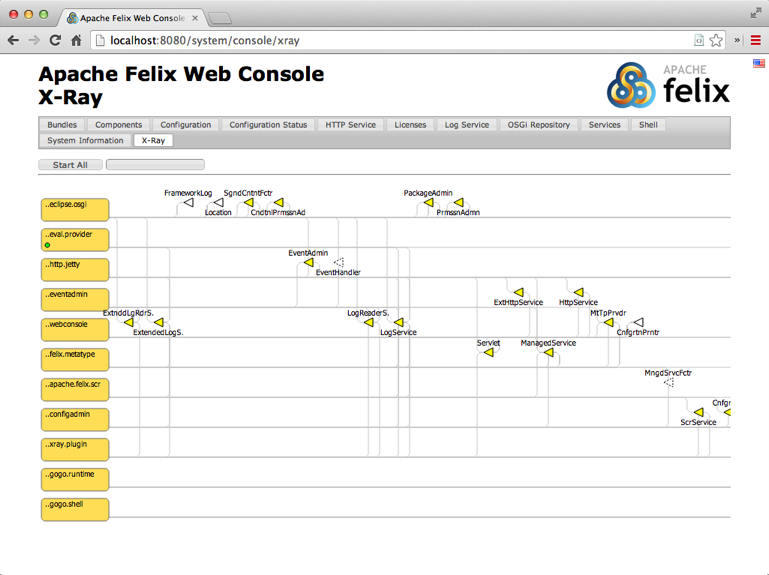
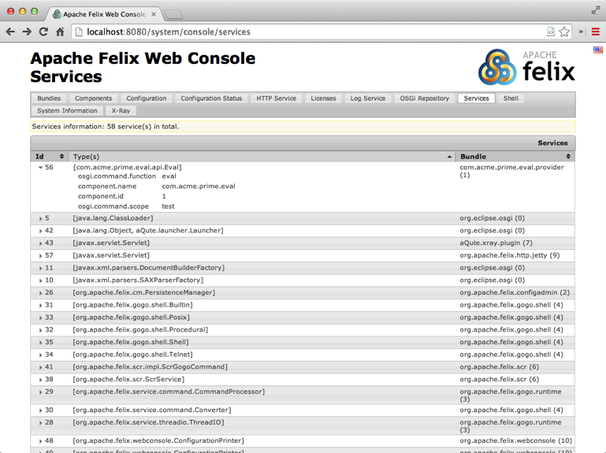
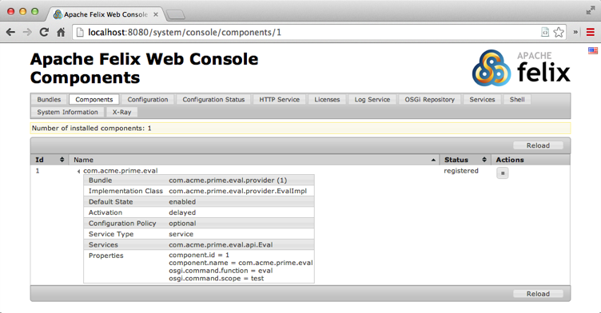
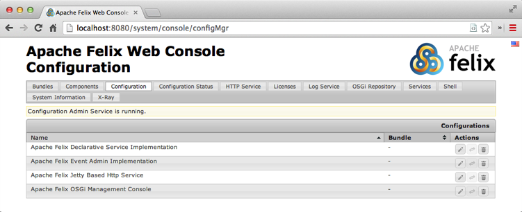
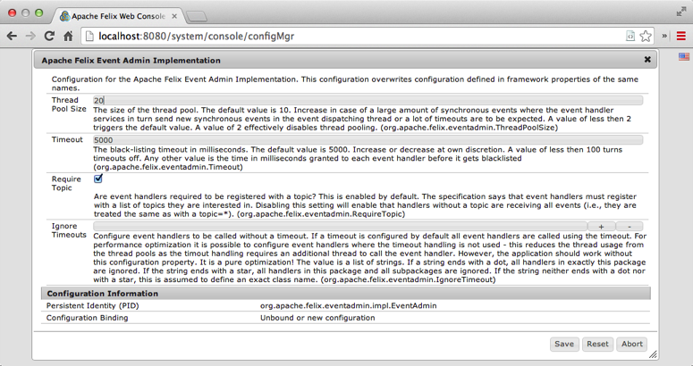
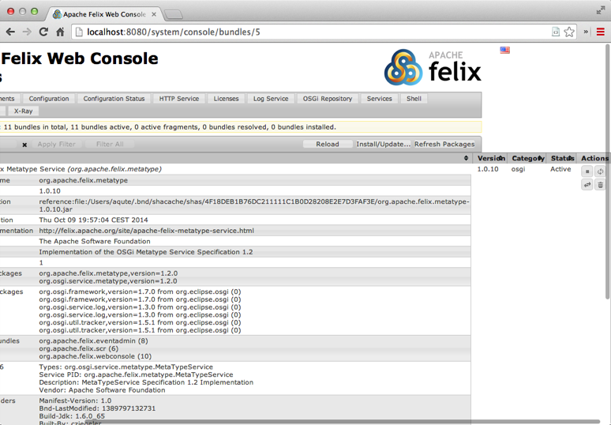
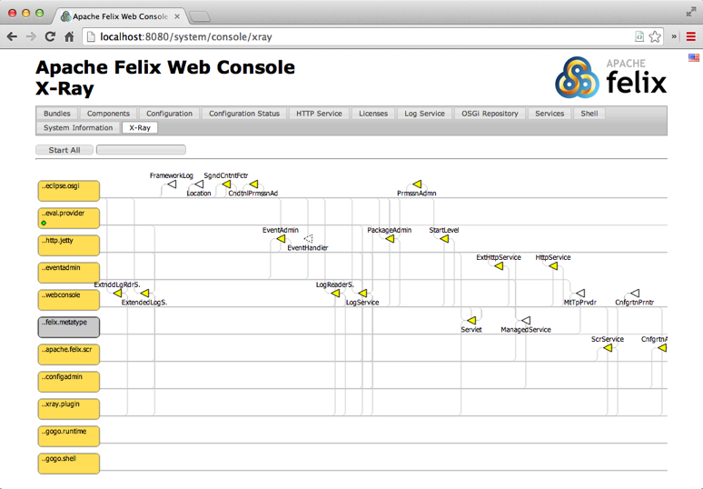

# Debugging

## What You Will Learn in This Section
In the previous section we learned how to run our bundle inside a framework. In this section we take a deeper look how we can debug this code. We teach you how to step through your bundles and how to use the extensive tools that are available.

## Debugging

While your OSGi framework is happily humming along and you're making changes there is a chance that you want to see what is going on inside. Just enter a normal IDE breakpoint (double click in the left margin) and make sure your code gets there. 

For example, put a breakpoint on the `EvalImpl.eval` method. When you enter the Gogo `test:eval` command, you will see that the IDE enters your breakpoint. Before you go to the debugger, however, Eclipse might annoy with the following dialog:

This dialog can be skipped, in general you really want to go to the debugger when you hit a breakpoint. Now you get the following setup:

As is normal in Java debuggers you can change the code and save it. In these situations you often get a warning that the IDE could not change the code and it requires a restart. 

Duh, that is only in stuffy classic environments! In an OSGi environment we do not really rely on the complex class patching hacks that Eclipse or JRebel attempt to do. A change means a new bundle that gets deployed to the running server. So even if the IDE is clever enough to patch the class, it would get quickly overridden with our new bundle. So just click on the checkbox to ignore this warning in the future.  

## What's Inside?

Of course OSGi enRoute will never let you down, your life will be tranquil, and you can spend lots of time on the beach. Ehh, well, we will try but computer intelligence is generally not that advanced yet and in the mean time you will have to do some debugging and diagnosing to make actual applications work. Sad, but true.

One of the great tools to debug OSGi applications is the Apache Felix Web Console. The Web Console provides insight in everything you wanted to know about OSGi, and actually a lot more.  Especially XRay, a web console plugin, is very useful for beginners because it visualizes the services layer very well. In Xray, each service type is represented by an icon and wires run back and forth to the bundles registering and getting them (and even just listening).

First switch back to the bndtools perspective (usuall the bndools icon is at the right top). Then double click the `bnd.bnd` file, select the `Run` tab and add the `osgi.enroute.webconsole.xray.provider` to the `Run Requirements` list. Since we use dependencies, this plugin will automatically drag in the web console and the required Jetty web server. 

Then hit `Resolve`. This will add a web server, Apache Felix Web Console, and XRay. Save the file, and then go to  [http://localhost:8080/system/console/xray](http://localhost:8080/system/console/xray). The default user id password is, surprisingly imaginative: `admin` and `admin` (thanks Felix guys, I won't forget it!). The Apache Felix Web Console is an amazing tool, so let's learn to use it!

BTW, if the provider bundle is grey, push the `Start All` button at the top of XRay.

If you accidentally did something wrong, then kill the running process (red button on the Console view). Then double click the `bnd.bnd` file, select the `Run` tab and click `Debug As`.

## XRay

XRay might not scale that well to large systems but for a lot of beginners it is an eye opener because it visualizes the dynamics of an OSGi framework. 

The actual canvas on which Xray is drawn is much bigger than shown here, you can scroll the window to the left.

### Services

Services are crucial interaction elements and they can occur many times in diagrams describing services. The triangle represents a service. Triangles can be connected in different ways, representing different meanings:

* Point – Connections to the point of a triangle indicate the registration. This makes the point of the triangle point to the object that receives the method calls from the service users.
* Straight Side – Connections to the straight side indicate service clients. Clients call the methods of the service.
* Angled Side – The angled side is reserved for service listeners.

You can see the triangle as an arrow; the direction is the dependency/call/use direction. Services are color coded. 

* Yellow – They are yellow when the service is registered and in use. 
* White, solid border – If a service is white but with a solid border then it is registered but nobody in the system cares about it.
* White, dashed border – If a service is white but has a dashed border then it means that there is a bundle looking for that service but nobody has an instance registered.
* Red – Something seriously wrong with the service. This is usually caused by not properly refreshing the system.
* Orange – Orange indicates that the service is exported or imported.

If you hover over a service then the connection lines to other services are removed, only the bundles that connect to that service remain. That said, the service triangle represents the _type_, not the instance. Even if there are 10000 instances of a given service, you will only see one triangle.

Almost all elements provide a tooltip when you hover over it and are clickable. If you click on a service, we navigate to the `Services` tab. Since each service can represent many service objects of the same type, you will have to find the appropriate service yourself.

The triangle on the left of the service gives you the details if you click on it. Notice how we can see that this service has registered the properties for the Gogo shell (scope and function) that we added in [the provider section](320-provider.html).

### Components

If we go back to XRay then we see that a bundle has a (hopefully) green LEDs; each of these LEDs represent a 
_component_. If it is green then it is happy, if it is red it misses either a dependency or its configuration. If you click on the LED, the `com.acme.prime.eval.provider` bundle, then you go to the `component tab` for this component. This tab will be your best friend! It gives you all the goodies about the component.

Most important is of course if its references are satisfied, and if so, by whom. In general, if a component is `active` or `registered` then it is happy. 

A tip. There is one puzzling use case. Sometimes a component is not satisfied but all its references are present. In that case you're likely missing configuration. Components can declare that they must be configured.

### Configuration

The `Configuration` tab provides access to Configuration Admin. This is one of the most interesting tabs because it provides a very decent interface to your configuration data. It turns out that with the Meta Type Service it is possible to provide sufficient information to create an editor. 

If you click on an entry then such an editor opens:

### Bundles

If you go back to XRay again then you can see the bundles as boxes with rounded corners on the left side. Bundles are also color coded:

* Orange – Active
* Grey – Resolved
* White – Installed

You can for example stop the Apache Felix Metatype bundle. First look at the registered service by hovering over this bundle, see that it registers a `MetaTypeService`. If you can't find it, type in `metatype` in the text box at the right top and hit return. This will make any name with metatype in it red. 

To stop the Apache Felix Metatype bundle, click on its box and then in the Bundle details tab click on the stop button (the standard player stop, a black square).

If you now go back to XRay, you'll see that the metatype bundle turned grey and it no longer has any registered services. 

If a plugin shows a warning sign then this means that there was an error in the log for this bundle. XRay tracks the logs and if it finds that a bundle has generated a log error or warning in the last 2 minutes then it marks the bundle with the warning sign. If you hover over it you can see the log message.

You can start all the bundles again by clicking the `Start All` button on the right top.

## How Does it Work?

First we created a runtime environment that included the XRay Web Console plugin. Since this plugin requires Web Console, and Web Console required the Http Server we got a complete environment. When the system is started, the XRay plugin bundle registers a special service that is detected by the Web Console. This is the so called white board. It then calls the plugin for its HTML.

The XRay plugin returns a page with Javascript that polls the server every so many seconds. The server returns the data which is then rendered by a javascript library (d3.js).

