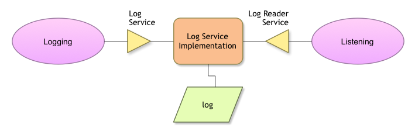

# LogService

The Log Service provides a general purpose message logger for the OSGi framework. It consists of two services, one for logging information and another for retrieving current or previously recorded log information.
This specification defines the methods and semantics of interfaces which bundle developers can use to log entries and to retrieve log entries.
Bundles can use the Log Service to log information for the Operator. Other bundles, oriented toward management of the environment, can use the Log Reader Service to retrieve Log Entry objects that were recorded recently or to receive Log Entry objects as they are logged by other bundles.

## Example

There is an example project at [Github](https://github.com/osgi/osgi.enroute.examples/tree/master/osgi.enroute.examples.logging.application)