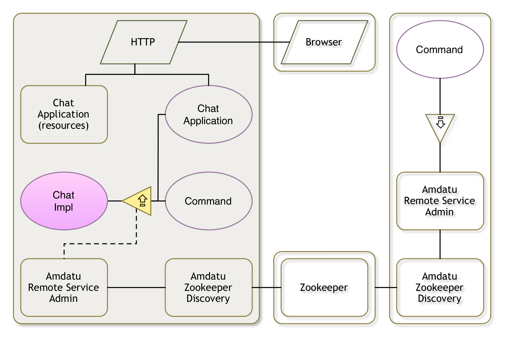

# Implementing the Chat API



We now have an API so the next step is to create an implementation for the Chat service. We can keep it extremely simple in this case since we're not interested in competing with Facebook messenger or Skype. So we make a simple provider that just sends the messages to the console. 

If we create a _provider_ Bndtools project with the OSGi enRoute templates then we get the proper setup. It will creates a project with a Declarative Services component for us. To setup a provider project, make sure the name of the project ends with `.provider`. In our case we will use the name `osgi.enroute.examples.chat.provider` for the project.

This gives us a bundle with a component like:

```java
package osgi.enroute.examples.chat.adapter;
	
import org.osgi.service.component.annotations.Component;

@Component(name = "osgi.enroute.examples.chat")
public class ChatImpl {
}
```
 
## Buildpath

Our first task is to add the API project to our `-buildpath` so we can add the Chat interface to our implementation. To extend the `-buildpath`, double click on the `bnd.bnd` file and select the `Build` tab. You can then press the `+` button or select the `Source` tab and edit the `-buildpath` instruction. It should look like:

	-buildpath: \
		osgi.enroute.base.api;version=1.0,\
		osgi.enroute.examples.chat.api;version=latest

The version `latest` is used because the project is in the same workspace.

## Writing the Implementation

To finish the implementation there are a number of things necessary. 

* Implement the `Chat` service interface
* Set the service property with the `user.name`
* Print the message to the console

The code looks then like:

```java
package osgi.enroute.examples.chat.provider;
	
import org.osgi.service.component.annotations.Component;

import osgi.enroute.examples.chat.api.Chat;
import osgi.enroute.examples.chat.api.Message;

@Component(
	name = "osgi.enroute.examples.chat", // CHANGE 
	property = "user.name=osgi"
)
public class ChatImpl implements Chat {

	@Override
	public boolean send(Message message) throws Exception {
		System.out.printf("%s: %s%n", message.from, message.text);
		return true;
	}

}
```

Make sure to change the name of the component to your namespace.

## Exporting the API

In OSGi it is just very good practice to export any API that a bundle _provides_. In our case we provide the Chat API and we therefore should export it. The reason is that this is a lot more user friendly than bundles that require all kinds of dependencies that are always required and in general cannot be substituted.

Double click on the `bnd.bnd` file and select the `Contents` tab. Click on the `+` of the `Export Packages` list and add the API package.

## Running

We can now try running the Chat implementation. For this, double click the `bnd.bnd` file and select the `Run` tab.

If we run the provider as is then we have no diagnostic tools to see what works. And since the service is lazy by design, we won't be able to use the debugger either. So we add the Gogo shell to make this work.

Ensure that the following requirements are listed in the `Run Requirements` list:

* Bundle `osgi.enroute.chat.provider` — (your name of course!)
* Bundle `org.apache.felix.gogo.shell` — Felix Gogo Shell
* Bundle `org.apache.felix.gogo.command` — Felix Gogo Commands

The resolve, save, and debug. This should give you a shell:

	----------------------------
	Welcome to Apache Felix Gogo	
	g!
{: .shell}

So let's do a quick check if your service is alive and breathing:

	g! servicereferences osgi.enroute.examples.chat.api.Chat null
	000054  10 Chat                                     
{: .shell}

Yeah!

## Testing

Obviously we should write a unit test for this class but we leave that as an exercise for the reader ...

Instead, we will use Gogo, the OSGi command shell, for testing our implementation in the next chapter.
