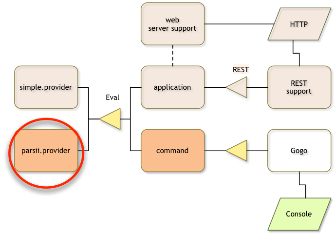

# Dependencies

## What You Will Learn in this Section

In this section we will replace the rather simplistic parser with an external
dependency from Maven Central. This dependency is [Parsii], a very lightweight expression
parser.



Make sure you are in the top directory:

	$ cd ~/workspaces/osgi.enroute.examples.eval
{: .shell }


## Create Project

Create a new project for the osgi.enroute.examples.parsii.provider in the `parsii.provider`
directory of the `osgi.enroute.examples.eval` directory. The `pom.xml` file should look like:

	osgi.enroute.examples.eval $ mkdir parsii.provider
	osgi.enroute.examples.eval $ cd parsii.provider
	parsii.provider $ vi pom.xml
	// add following pom
{: .shell }
	
	<project 
		xmlns="http://maven.apache.org/POM/4.0.0" 
		xmlns:xsi="http://www.w3.org/2001/XMLSchema-instance"
		xsi:schemaLocation="http://maven.apache.org/POM/4.0.0 http://maven.apache.org/xsd/maven-4.0.0.xsd"
	>
		<modelVersion>4.0.0</modelVersion>
		
		<parent>
			<groupId>org.osgi</groupId>
			<artifactId>osgi.enroute.examples.eval</artifactId>
			<version>1.0.0-SNAPSHOT</version>
		</parent>

		<artifactId>osgi.enroute.examples.eval.parsii.provider</artifactId>
		<description>Eval Provider based on Parsii library</description>
	
		<dependencies>
			<dependency>
				<groupId>com.scireum</groupId>
				<artifactId>parsii</artifactId>
				<version>2.3</version>
			</dependency>
			<dependency>
				<groupId>org.osgi</groupId>
				<artifactId>osgi.enroute.examples.eval.api</artifactId>
				<version>1.0.0-SNAPSHOT</version>
			</dependency>
		</dependencies>
	</project>

This is quite similar to the simple provider that we had earlier but now with
an extra dependency for the Parsii parser.

## Source Code

We can use the following source code:

	parsii.provider $ mkdir -p src/main/java/osgi/enroute/examples/eval/parsii/provider
	parsii.provider $ vi src/main/java/osgi/enroute/examples/eval/parsii/provider/EvalImpl.java
	// Add the following code
{: .shell }

```java
package osgi.enroute.examples.eval.parsii.provider;
	
import org.osgi.service.component.annotations.Component;
import org.osgi.service.component.annotations.Reference;
import org.osgi.service.log.LogService;

import osgi.enroute.examples.eval.api.Eval;
import parsii.eval.Parser;

@Component(name = "osgi.enroute.examples.eval.parsii.provider")
public class EvalImpl implements Eval {

	@Reference
	LogService log;
	
	@Override
	public double eval(String expression) throws Exception {
		return Parser.parse(expression).evaluate();
	}
}
```

The reference to the log service is not used. This line was added to solve
a bug in bnd that should soon be solved. The problem was that for a very simple
DS use no `osgi.extender` requirement is included.
{: .note }

## Bundle Layout

The bnd.bnd file is a bit more complex than the simple provider we made before. The
reason is that the dependency we added is not a bundle, we can therefore not
depend on this JAR in the runtime. In these cases, there are two different tracks
to take. You can either _wrap_ this bundle or _include_ it. Wrapping a bundle means
creating a new project and providing the OSGi metadata. Including the JAR means
including the required packages from the JAR with bnd's Private-Package instruction.

In this example we've selected the including strategy. The bnd.bnd file therefore looks as
follows:

	parsii.provider $ vi bnd.bnd
	// add the following bnd.bnd
{: .shell }

	Export-Package: osgi.enroute.examples.eval.api
	
	Private-Package: \
		parsii.*, \
		osgi.enroute.examples.eval.parsii.provider

Just like the simple provider, we've exported the API. However, where we've used
the default of all classes from the project for the simple provider, here we
explicitly list the packages that we want included. 

Maven does not clean the classes directory for a build automatically. This means
that only after a `mvn clean` can you be assured of the right content. In practice,
it is easy to end up with classes from long gone experiments with the bnd.bnd file.
{: .note }

## Building

Again, don't forget to add the parsii.provider module to the parent pom.

We now build the bundle:

	parsii.provider $ mvn install
	...
	parsii.provider $ bnd print target/osgi.enroute.examples.eval.parsii.provider-1.0.0-SNAPSHOT.jar 
	[MANIFEST osgi.enroute.examples.eval.parsii.provider-1.0.0-SNAPSHOT]
	Bnd-LastModified                         1475601027531                           
	Build-Jdk                                1.8.0_25                                
	Built-By                                 aqute                                   
	Bundle-ManifestVersion                   2                                       
	Bundle-Name                              osgi.enroute.examples.eval.parsii.provider
	Bundle-SymbolicName                      osgi.enroute.examples.eval.parsii.provider
	Bundle-Version                           1.0.0.201610041710                      
	Created-By                               1.8.0_25 (Oracle Corporation)           
	Export-Package                           osgi.enroute.examples.eval.api;version="1.0.0"
	Import-Package                           osgi.enroute.examples.eval.api;version="[1.0,1.1)"
	Manifest-Version                         1.0                                     
	Private-Package                          parsii.tokenizer,parsii.eval,osgi.enroute.examples.eval.parsii.provider
	Provide-Capability                       osgi.service;objectClass:List<String>="osgi.enroute.examples.eval.api.Eval"
	Require-Capability                       osgi.ee;filter:="(&(osgi.ee=JavaSE)(version=1.8))"
	Service-Component                        OSGI-INF/osgi.enroute.examples.eval.parsii.provider.xml
	Tool                                     Bnd-3.3.0.201609221906                  
	
	[IMPEXP]
	Import-Package
	  osgi.enroute.examples.eval.api         {version=[1.0,1.1)}
	Export-Package
	  osgi.enroute.examples.eval.api         {version=1.0.0, imported-as=[1.0,1.1)}
{: .shell }

The Private-Package header added by bnd clearly shows that we've added the `parsii` packages that it found in the bundle. We specified a wild card in the `bnd.bnd` file for Private-Package but in the manifest we can clearly see that there are `parsii.tokenizer` and `parsii.eval` packages on the classpath.

## Running It

We should now switch to the bndrun project.

	parsii.provider $ cd ../bndrun
	parsii.provider $ vi pom.xml
	// replace dependencies with next section
{: .shell }

We first need to replace the simple provider with our newly eval parser in the pom.xml in this project so
it can be used by the resolver. The dependencies should therefore look like:

          <dependencies>
                <dependency>
                        <groupId>org.osgi</groupId>
                        <artifactId>osgi.enroute.examples.eval.parsii.provider</artifactId>
                        <version>1.0.0-SNAPSHOT</version>
                </dependency>
                <dependency>
                        <groupId>org.apache.felix</groupId>
                        <artifactId>org.apache.felix.gogo.shell</artifactId>
                        <version>1.0.0</version>
                </dependency>
                <dependency>
                        <groupId>org.osgi</groupId>
                        <artifactId>osgi.enroute.examples.eval.command</artifactId>
                        <version>1.0.0-SNAPSHOT</version>
                </dependency>
                <dependency>
                        <groupId>org.osgi</groupId>
                        <artifactId>osgi.enroute.pom.distro</artifactId>
                        <version>2.0.0</version>
                </dependency>
        </dependencies>
  
In the bndrun project in the `osgi.enroute.examples.eval.bndrun` file, we need to 
change the `-runrequires` to use the `parsii.provider` instead of the simple provider:


	parsii.provider $ cd ../bndrun
	bndrun $ vi osgi.enroute.examples.eval.bndrun
	// Replace the -runrequires
{: .shell }

	-runrequires: \
		osgi.identity;filter:='(osgi.identity=org.apache.felix.gogo.shell)',\
		osgi.identity;filter:='(osgi.identity=org.apache.felix.gogo.command)',\
		osgi.identity;filter:='(osgi.identity=osgi.enroute.examples.eval.command)',\
		osgi.identity;filter:='(osgi.identity=osgi.enroute.examples.eval.parsii.provider)'

Then resolve, which should give something like:

	bndrun $ mvn install
	...
	-runbundles: \
		org.apache.felix.configadmin; version='[1.8.8,1.8.9)',\
		org.apache.felix.gogo.command; version='[0.16.0,0.16.1)',\
		org.apache.felix.gogo.runtime; version='[0.16.2,0.16.3)',\
		org.apache.felix.log; version='[1.0.1,1.0.2)',\
		org.apache.felix.scr; version='[2.0.2,2.0.3)',\
		org.eclipse.equinox.metatype; version='[1.4.100,1.4.101)',\
		org.osgi.service.metatype; version='[1.3.0,1.3.1)',\
		osgi.enroute.examples.eval.command; version='[1.0.0,1.0.1)',\
		osgi.enroute.examples.eval.parsii.provider; version='[1.0.0,1.0.1)',\
		org.apache.felix.gogo.shell; version='[2.0.0,2.0.1)'
	...
{: .shell }

And then update the `osgi.enroute.examples.eval.bndrun` file with the returned `-runbundles` and run `mvn install` again. 

We can then run the application:

	bndrun $ java -jar osgi.enroute.examples.eval.jar
		         ____             _       
	   ___ _ __ |  _ \ ___  _   _| |_ ___ 
	  / _ \ '_ \| |_) / _ \| | | | __/ _ \
	 |  __/ | | |  _ < (_) | |_| | |_  __/
	  \___|_| |_|_| \_\___/ \__,_|\__\___|
	              http://enroute.osgi.org/
	G! eval sin(pi)
	1.2246467991473532E-16
	G! eval cos(pi)
	-1.0
	G! 
{: .shell }

## What did We Learn in this Section?

We created a new provider that used an external dependency. We needed to include
the code from this dependency inside our new bundle because the Parsii JAR does
not contain any OSGi metadata. 

We then added this new project to the modules and updated the bndrun project
to use the new Parsii provider.

And it worked!

[Parsii]: https://github.com/scireum/parsii
